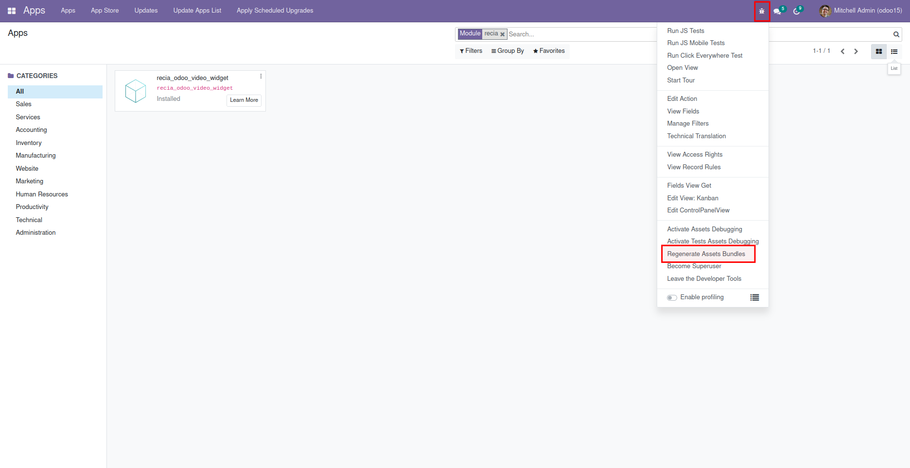

# Installation

Copy folder `recia_odoo_video_widget` into `[oddo install dir]/addons/`

Connect into odoo with administrator account

Clic on 'Activate the developer mode' in 'Developer Tools' section at the end of the settings page

Clic on the 'Update Apps List' in the header of the 'Apps' page

Search for 'recia' (remove 'Apps' from the search input) in the 'Apps' page

Install 'recia_odoo_video_widget'

Update assets clicking on the 'bug icon' and then 'Regenerate Assets Bundles' in the header 
